# Guide d'utilisation

L'extension Géoplateforme vous permet de publier vos données sur cartes.gouv.fr via la Géoplateforme directement depuis QGIS.

Elle est constituée d'un ensemble de traitements QGIS et d'interface graphique pour leur utilisation et la visualisation des données disponibles sur cartes.gouv.fr.

La recherche des données sur la Géoplateforme est intégrée dans le [Gestionnaire des sources de données de QGIS](https://docs.qgis.org/3.40/fr/docs/user_manual/managing_data_source/opening_data.html#provider-based-loading-tools).

## Menu

Le menu de l'extension permet d'afficher les différents outils disponibles.

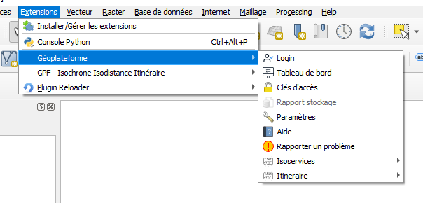

Vous pouvez aussi afficher l'aide en ligne et les paramètres de l'extension.

:::{note}
Le menu peut changer selon les plugins référencés installés. Voir [la page dédiée](../external_plugins/integration.md).
:::

## Barre d'outils

Les actions de l'extension Géoplateforme sont aussi disponibles via les barres d'outils de QGIS.

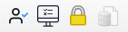

Si vous n'êtes pas encore connecté, seule l'action de connection est disponible.

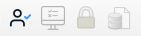

----

## Connexion

Pour certaines fonctionnalités, il est nécessaire de s'authentifier à la Géoplateforme via le bouton suivant :

Si vous n'êtes pas déjà connecté vous pouvez demander une connection sur cartes.gouv.fr via le bouton correspondant.

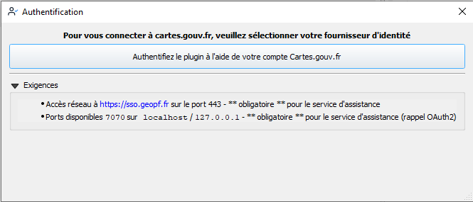

Vous serez redirigé vers la plateforme de connection de cartes.gouv.fr.

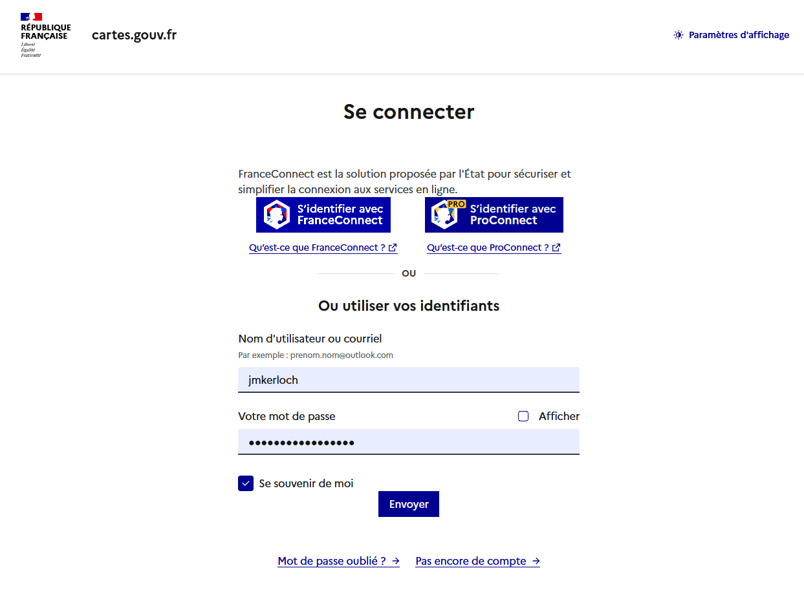

Si vous êtes déjà connecté, des informations sur l'utilisateur courant sont affichées :

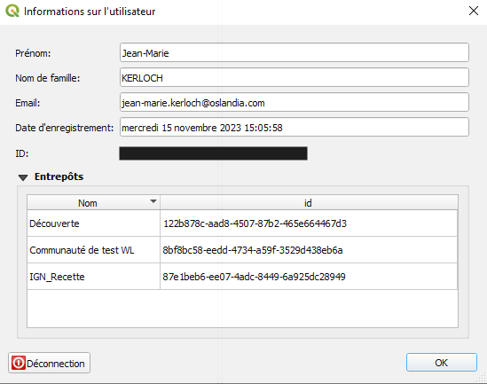

Vous pouvez vous déconnecter ou visualiser les identifiants des entrepôts disponibles.

----

## Gestionnaire des sources de données

La recherche des données sur la Géoplateforme est intégrée dans le [Gestionnaire des sources de données de QGIS](https://docs.qgis.org/3.40/fr/docs/user_manual/managing_data_source/opening_data.html#provider-based-loading-tools).

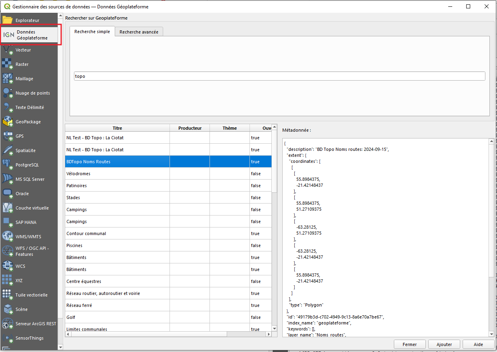

2 modes de recherche sont disponibles

- Recherche simple : la recherche est effectuée sur le texte défini par l'utilisateur
- Recherche avancée : la recherche est effectué selon des critères précis (titre, nom de couche, visibilité, ...)

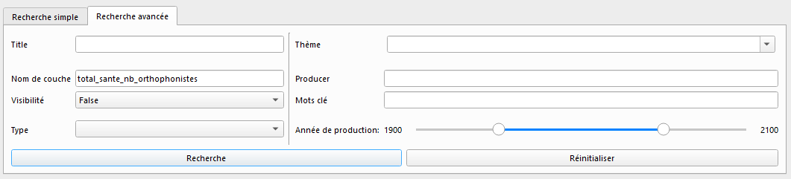

Une fois la donnée sélectionnée vous pouvez l'ajouter à vos couches QGIS via le bouton `Ajouter`.

Si la donnée est privée vous pouvez sélectionner une configuration d'authentification de QGIS.

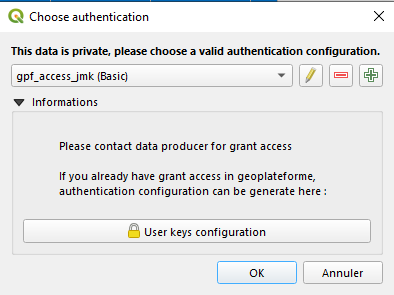

----

## Tableau de bord

Le tableau de bord peut être affiché via le bouton suivant :

Voici un aperçu de l'interface graphique disponible :

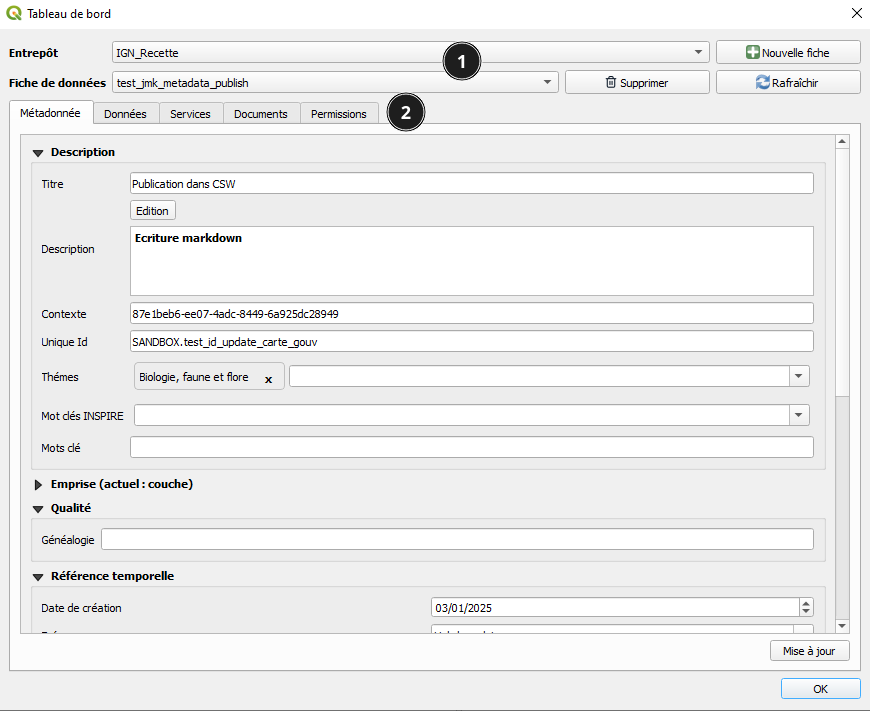

Vous pouvez trouver:

1. Des composants pour choisir l'entrepôt et la fiche de données visualisée
2. Un ensemble d'onglet affichant les informations de la fiche de donnée

Les onglets disponibles sont:

- Métadonnées
- Données
- Services
- Document (fonctionnalité en attente de développement).
- Permissions

### Création d'une fiche de donnée

La création d'une nouvelle fiche est effectuée via le bouton `Nouvelle fiche`.

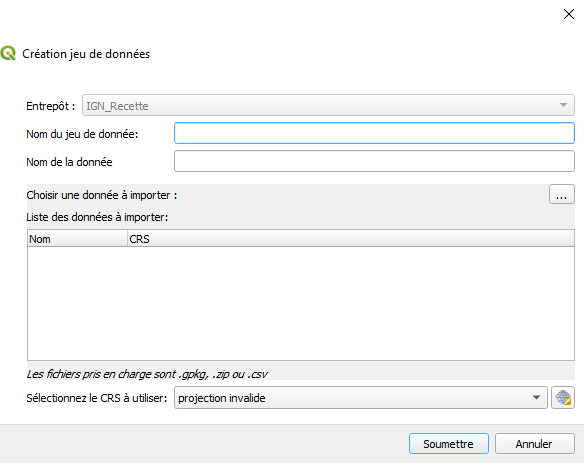

Vous pouvez choisir les données à importer via le bouton `...`.

Une nouvelle interface est affichée.

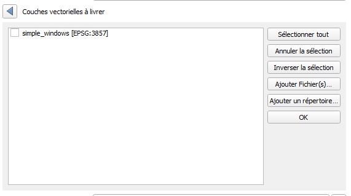.

Vous pourrez y sélectionner les couches disponibles dans QGIS et ajouter un fichier depuis la barre d'outils à droite.

Une fois les fichiers sélectionné vous pouvez cliquer sur la flèche de retour ou OK pour afficher la liste des données à importer.

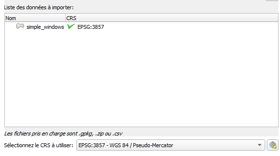.

Si cela est possible, le CRS de la donnée est affichée et la liste des couches contenues dans les GPKG est affichée.

En cas de divergence de CRS un avertissement est affiché.

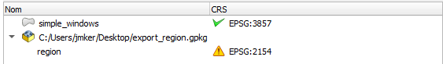.

Une fois vos fichiers et couches sélectionnés vous pouvez lancer l'intégration dans la Géoplateforme avec le bouton `Soumettre`.

Une fenêtre est affichée pour afficher les différentes étapes de la livraison.

Il n'est pas possible de la fermer tant que les données ne sont pas disponible sur l'entrepôt.

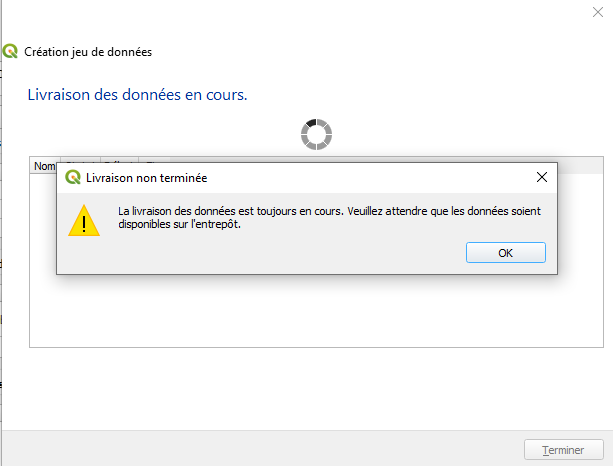.

Vous pourrez ensuite voir les étapes de vérification en cours dans l'entrepôt.

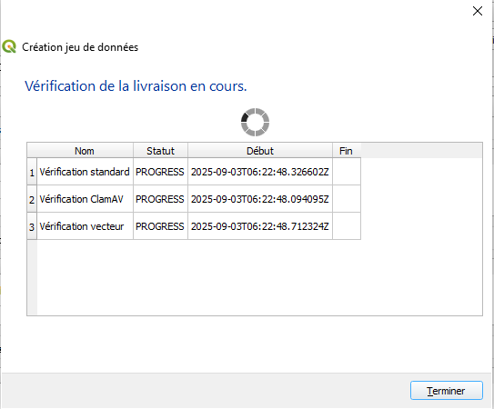.

Si vous fermez la fenêtre avant la fin des vérifications, le traitement pour l'intégration des données en base ne sera pas lancée. Un message vous averti que le traitement devra être lancé ultérieurement.

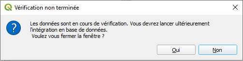.

### Données

Cet onglet contient l'ensemble des données associées à la fiche de données courante.

4 tableaux sont disponibles:

- Livraisons
- Base de données vecteur
- Pyramides de tuiles vectorielles
- Pyramides de tuiles raster

Lors de la sélection d'une ligne du tableau, un panneau est affiché à droite pour décrire la donnée sélectionnée.

Les actions disponibles dépendent du type de la donnée sélectionnée.

Vous pouvez ajouter des données à la fiche de données via le bouton `Ajouter des données`.

#### Livraisons

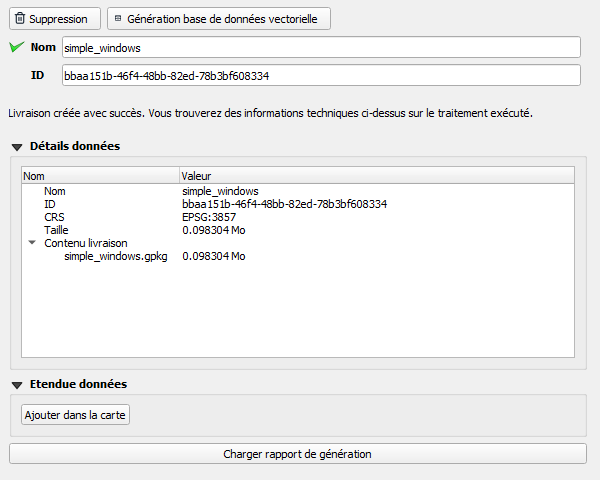.

Le panneau des livraisons permet d'afficher les détails des données livrées. Le bouton `Charger rapport de génération` vous permet de récupérer les logs pour l'ensemble des traitements et vérifications effectués pour la livraison.

2 actions sont disponibles pour les livraisons :

- `Suppression` : demande de suppression de la livraison. Les bases de données vecteur créées depuis la livraison ne sont pas supprimées.
- `Génération base de données vectorielle` : demande du lancement du traitement pour la génération d'une base de données vecteur.

#### Bases de données vecteur

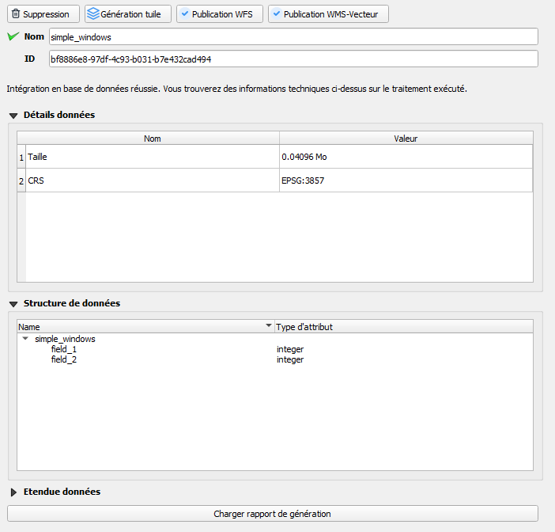.

Le panneau des bases de données vecteur permet d'afficher les détails des bases livrées. Le bouton `Charger rapport de génération` vous permet de récupérer les logs pour l'ensemble des traitements et vérifications effectués pour la base de données.

4 actions sont disponibles pour les bases de données vecteur :

- `Suppression` : demande de suppression de la base de données.
- `Génération tuile` : demande de génération de tuiles vectorielles
- `Publication WFS` : demande de publication WFS
- `Publication WMS-Vecteur` : demande de publication WMS-Vecteur

##### Génération de tuiles vectorielles

Les paramètres nécessaires à la génération de tuiles vectorielles sont définis via plusieurs pages. Vous pouvez à tout moment revenir à la page précédente via la flèche de retour située en haut à gauche (sous Windows) ou via le bouton retour situé à coté du bouton suivant (sous Linux).

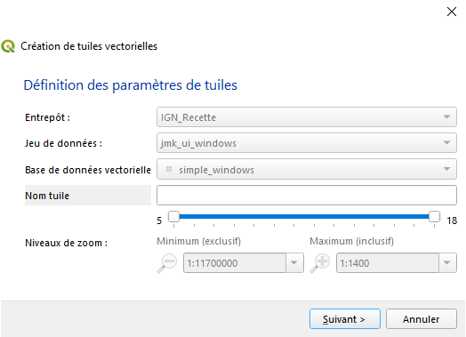.

Vous devez définir un nom et les niveaux de zoom à utiliser.

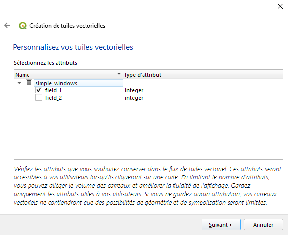.

Vous devez sélectionner les tables et attributs à utiliser.

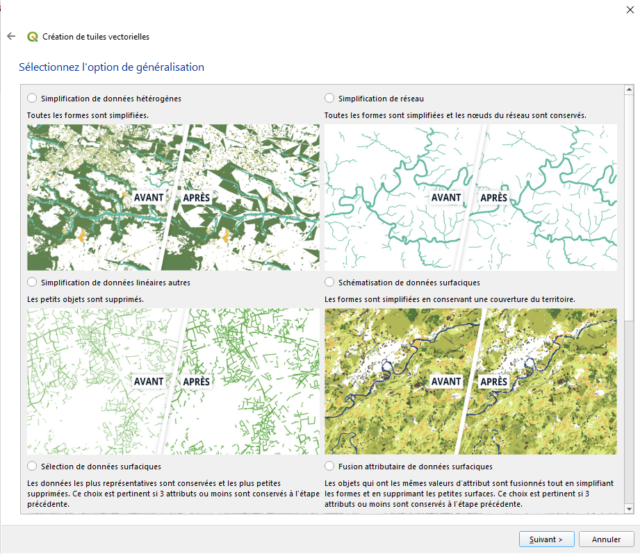.

Vous devez sélectionner l'option de généralisation à appliquer.

La génération est ensuite lancée dans la géoplateforme.

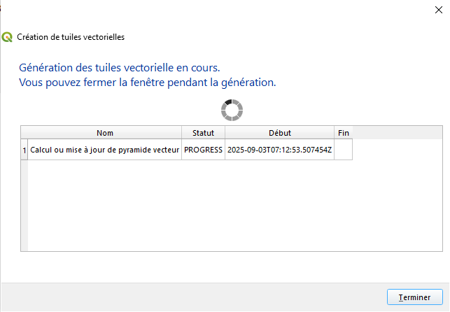.

Vous pouvez fermer la fenêtre pendant la génération.

##### Publication WFS

Les paramètres nécessaires à la publication WFS sont définis via plusieurs pages. Vous pouvez à tout moment revenir à la page précédente via la flèche de retour située en haut à gauche (sous Windows) ou via le bouton retour situé à coté du bouton suivant (sous Linux).

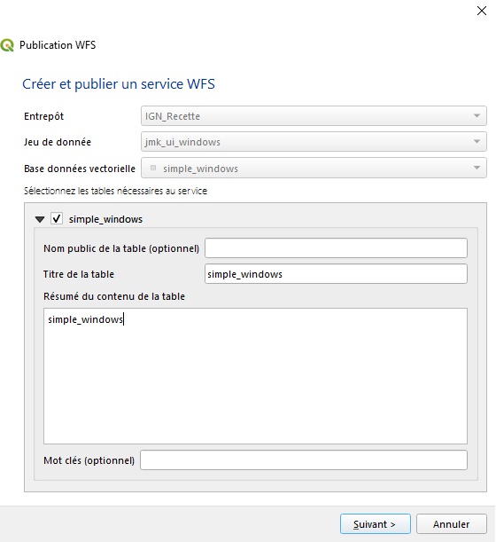.

Vous devez définir les tables nécessaires au service. Le titre de la table et le résumé sont obligatoires pour chaque table utilisée.

Vous devez sélectionner au moins une table.

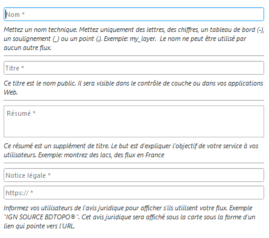.

Tout les paramètres sont obligatoires.

Le nom technique doit être unique pour tout les services de l'entrepôt utilisé.

Si c'est le cas, une erreur sera remontée lors de la publication et vous pourrez revenir à cette page pour le modifier.

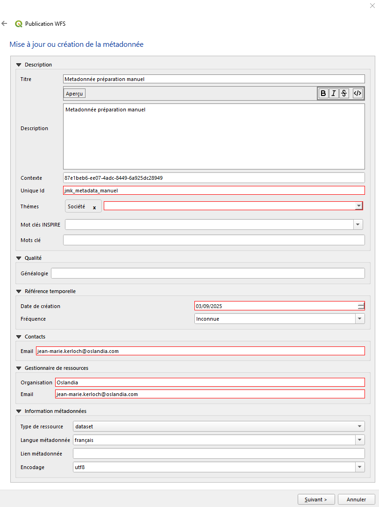.

Cette page vous permet de créer ou de mettre à jour la métadonnée associée au jeu de données. La métadonnée est unique pour tout les services du jeu de donnée.

Si des paramètres sont manquants, ils sont indiqués en rouge dans l'interface.

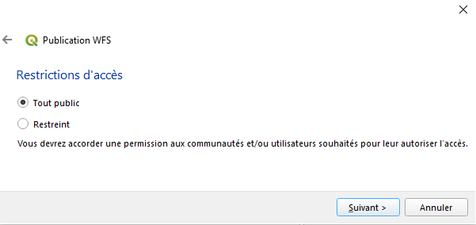.

Vous pouvez choisir de restreindre l'accès au service.

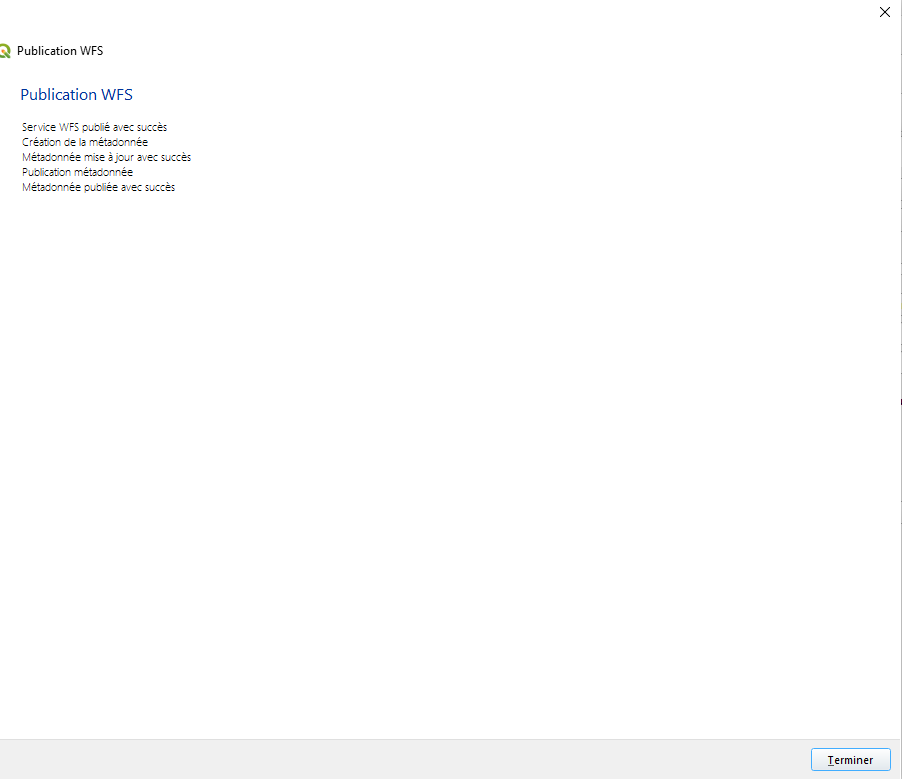.

La publication est ensuite effectuée sur la Géoplateforme.

Une fois le service publié, la métadonnée doit être créée ou mise à jour. Il n'est pas possible de fermer la page pendant ces traitements.

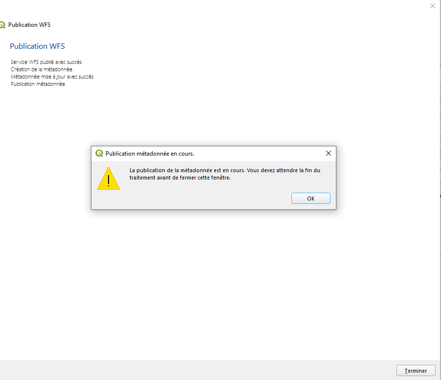.

Le service créé est automatiquement sélectionné dans le tableau de bord après la fermeture de la fenêtre de publication.

##### Publication WMS-Vecteur

Les paramètres nécessaires à la publication WMS-Vecteur sont définis via plusieurs pages. Vous pouvez à tout moment revenir à la page précédente via la flèche de retour située en haut à gauche (sous Windows) ou via le bouton retour situé à coté du bouton suivant (sous Linux).

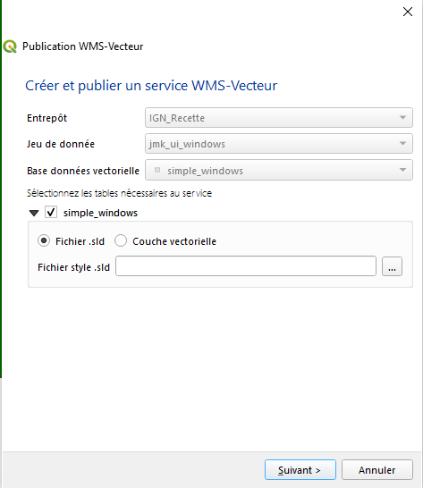.

Vous devez définir les tables nécessaires au service.

Vous devez sélectionner au moins une table.

Un fichier de style .sld doit être défini pour chaque table. Ce fichier peut être sélectionné depuis votre ordinateur ou créer depuis une couche chargée dans QGIS.

Attention, seul le format SLD 1.0.0 est supporté par la Géoplateforme. Un outils de conversion est disponible dans les traitements QGIS (conversion partielle, toutes les symbologies ne sont pas supportées).

Si vous sélectionnez une couche chargée dans QGIS, un export du style courant au format SLD est effectuée (version 1.1.0) puis l'outil de conversion est appelé pour produire un fichier au format 1.0.0.

.

Tout les paramètres sont obligatoires.

Le nom technique doit être unique pour tout les services de l'entrepôt utilisé.

Si c'est le cas, une erreur sera remontée lors de la publication et vous pourrez revenir à cette page pour le modifier.

.

Cette page vous permet de créer ou de mettre à jour la métadonnée associée au jeu de données. La métadonnée est unique pour tout les services du jeu de donnée.

Si des paramètres sont manquants, ils sont indiqués en rouge dans l'interface.

.

Vous pouvez choisir de restreindre l'accès au service.

.

La publication est ensuite effectuée sur la Géoplateforme.

Une fois le service publié, la métadonnée doit être créée ou mise à jour. Il n'est pas possible de fermer la page pendant ces traitements.

.

Le service créé est automatiquement sélectionné dans le tableau de bord après la fermeture de la fenêtre de publication.

#### Pyramides de tuiles vectorielles

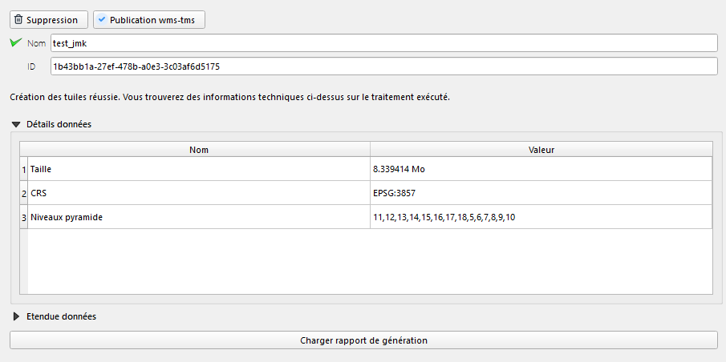.

Le panneau des pyramides de tuiles vectorielles permet d'afficher les détails des pyramides livrées. Le bouton `Charger rapport de génération` vous permet de récupérer les logs pour l'ensemble des traitements et vérifications effectués.

2 actions sont disponibles pour les pyramides de tuiles vectorielles :

- `Suppression` : demande de suppression de la pyramide.
- `Publication wms-tms` : demande de publication WMS-TMS

##### Publication WMS-TMS

Les paramètres nécessaires à la publication WMS-TMS sont définis via plusieurs pages. Vous pouvez à tout moment revenir à la page précédente via la flèche de retour située en haut à gauche (sous Windows) ou via le bouton retour situé à coté du bouton suivant (sous Linux).

.

Tout les paramètres sont obligatoires.

Le nom technique doit être unique pour tout les services de l'entrepôt utilisé.

Si c'est le cas, une erreur sera remontée lors de la publication et vous pourrez revenir à cette page pour le modifier.

.

Cette page vous permet de créer ou de mettre à jour la métadonnée associée au jeu de données. La métadonnée est unique pour tout les services du jeu de donnée.

Si des paramètres sont manquants, ils sont indiqués en rouge dans l'interface.

.

Vous pouvez choisir de restreindre l'accès au service.

.

La publication est ensuite effectuée sur la Géoplateforme.

Une fois le service publié, la métadonnée doit être créée ou mise à jour. Il n'est pas possible de fermer la page pendant ces traitements.

.

Le service créé est automatiquement sélectionné dans le tableau de bord après la fermeture de la fenêtre de publication.

#### Pyramides de tuiles raster

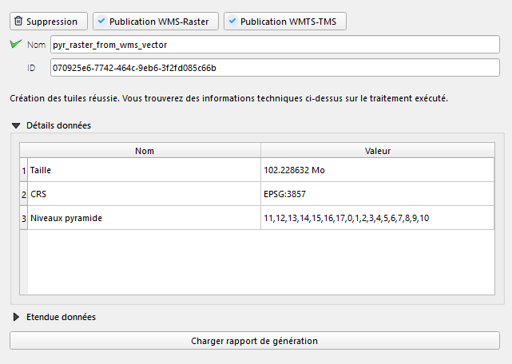.

Le panneau des pyramides de tuiles raster permet d'afficher les détails des pyramides livrées. Le bouton `Charger rapport de génération` vous permet de récupérer les logs pour l'ensemble des traitements et vérifications effectués.

3 actions sont disponibles pour les pyramides de tuiles vectorielles :

- `Suppression` : demande de suppression de la pyramide.
- `Publication WMS-Raster` : demande de publication WMS-Raster
- `Publication WMTS-TMS` : demande de publication WMTS-TMS

##### Publication WMS-Raster

Les paramètres nécessaires à la publication WMS-Raster sont définis via plusieurs pages. Vous pouvez à tout moment revenir à la page précédente via la flèche de retour située en haut à gauche (sous Windows) ou via le bouton retour situé à coté du bouton suivant (sous Linux).

.

Tout les paramètres sont obligatoires.

Le nom technique doit être unique pour tout les services de l'entrepôt utilisé.

Si c'est le cas, une erreur sera remontée lors de la publication et vous pourrez revenir à cette page pour le modifier.

.

Cette page vous permet de créer ou de mettre à jour la métadonnée associée au jeu de données. La métadonnée est unique pour tout les services du jeu de donnée.

Si des paramètres sont manquants, ils sont indiqués en rouge dans l'interface.

.

Vous pouvez choisir de restreindre l'accès au service.

.

La publication est ensuite effectuée sur la Géoplateforme.

Une fois le service publié, la métadonnée doit être créée ou mise à jour. Il n'est pas possible de fermer la page pendant ces traitements.

.

Le service créé est automatiquement sélectionné dans le tableau de bord après la fermeture de la fenêtre de publication.

##### Publication WMTS-TMS

Les paramètres nécessaires à la publication WMTS-TMS sont définis via plusieurs pages. Vous pouvez à tout moment revenir à la page précédente via la flèche de retour située en haut à gauche (sous Windows) ou via le bouton retour situé à coté du bouton suivant (sous Linux).

.

Tout les paramètres sont obligatoires.

Le nom technique doit être unique pour tout les services de l'entrepôt utilisé.

Si c'est le cas, une erreur sera remontée lors de la publication et vous pourrez revenir à cette page pour le modifier.

.

Cette page vous permet de créer ou de mettre à jour la métadonnée associée au jeu de données. La métadonnée est unique pour tout les services du jeu de donnée.

Si des paramètres sont manquants, ils sont indiqués en rouge dans l'interface.

.

Vous pouvez choisir de restreindre l'accès au service.

.

La publication est ensuite effectuée sur la Géoplateforme.

Une fois le service publié, la métadonnée doit être créée ou mise à jour. Il n'est pas possible de fermer la page pendant ces traitements.

.

Le service créé est automatiquement sélectionné dans le tableau de bord après la fermeture de la fenêtre de publication.

### Services

Cet onglet contient l'ensemble des services disponibles pour le jeu de données sélectionné.

Lors de la sélection d'un service, un panneau est affiché à droite pour décrire le service sélectionné.

.

2 actions sont toujours disponibles :

- `Dépublication` : demande la dépublication du service
- `Charger` : charge le service dans QGIS

D'autres fonctionnalités peuvent être affichées selon le service sélectionné

- gestion des styles
- gestion des permission
- génération de tuiles raster

#### Gestion des styles

Pour les services WFS et WMS-Vecteur, il est possible d'ajouter des fichiers de styles.

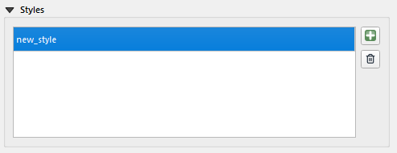

Lors de la demande d'ajout vous pourrez choisir le nom du style et le fichier de style à utiliser.

Au format .sld pour les services WFS :

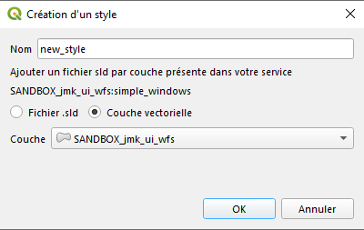

Au format .json mapbox pour les services WMS-Vecteur :

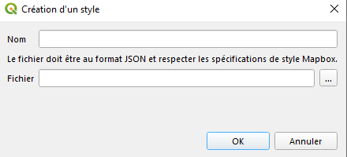

#### Gestions des permissions

Pour les services fermés, il est possible d'ajouter une permission.

Un tableau affiche les permissions associées à ce service et il est possible d'ajouter une permission.

Pour la création et la mise à jour des permissions, veuillez vous référer au chapitre des Permissions.

----

### Métadonnée

Cet onglet contient la métadonnée associée à la fiche de donnée.

Cette métadonnée est unique pour tout les services de la fiche de donnée. Elle est mise à jour à chaque publication ou dépublication d'un service.

Aucune métadonnée n'est publié tant qu'un service n'a pas été publié.

.

Une fois les modifications effectués, il est nécessaire d'appuyer sur le bouton `Mise à jour` pour lancer la mise à jour de la métadonnée dans la Géoplateforme.

### Permission

Cet onglet contient toutes les permissions accordées pour cet entrepot.

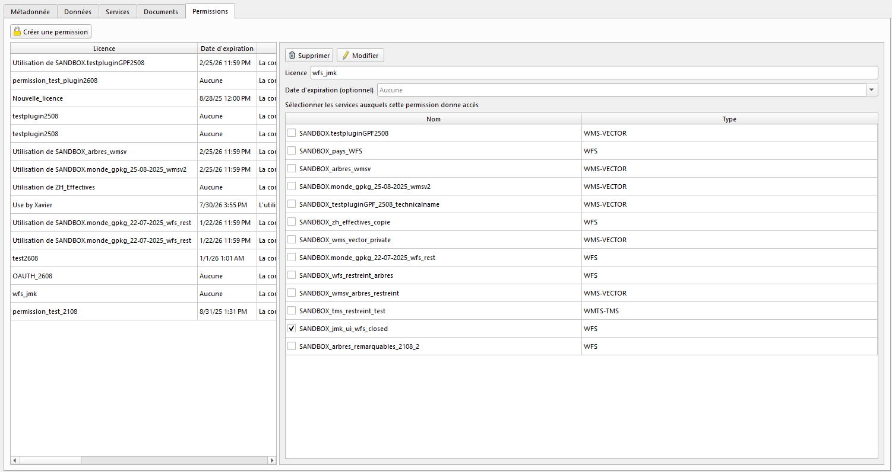.

Il est possible d'ajouter une permission avec le bouton `Créer une permission`.

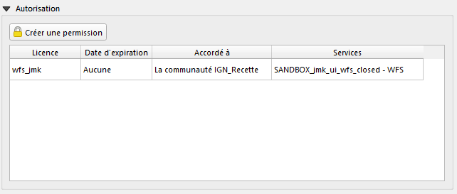

La fenêtre de création vous permet de définir :

- le nom de la permission (license)
- à qui la permission est accordée (des communautés ou des utilisateurs)
- sa date d'expiration (optionnel)
- les services auxquels cette permission donne accès

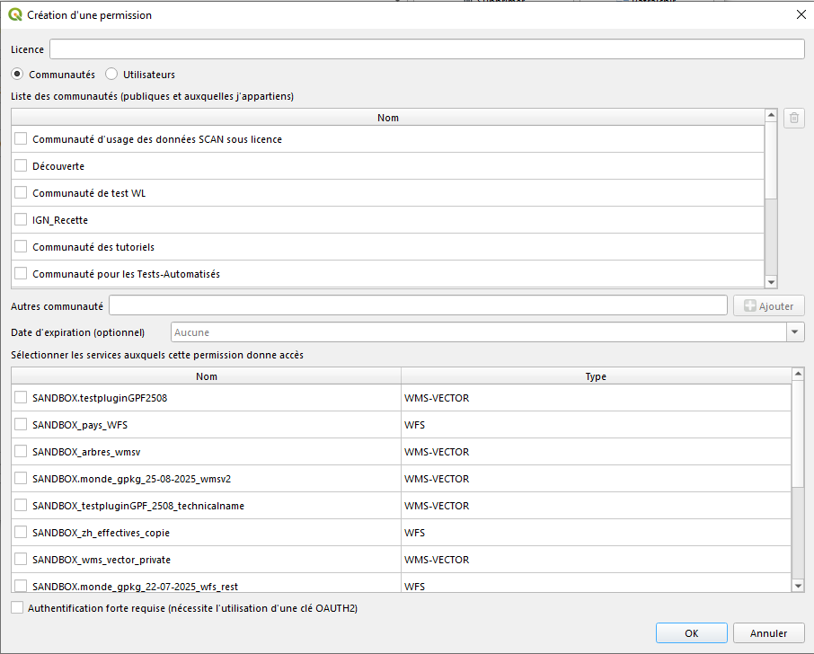

Lors de la sélection d'une permission, un panneau complémentaire est affiché à droite du tableau des permissions.

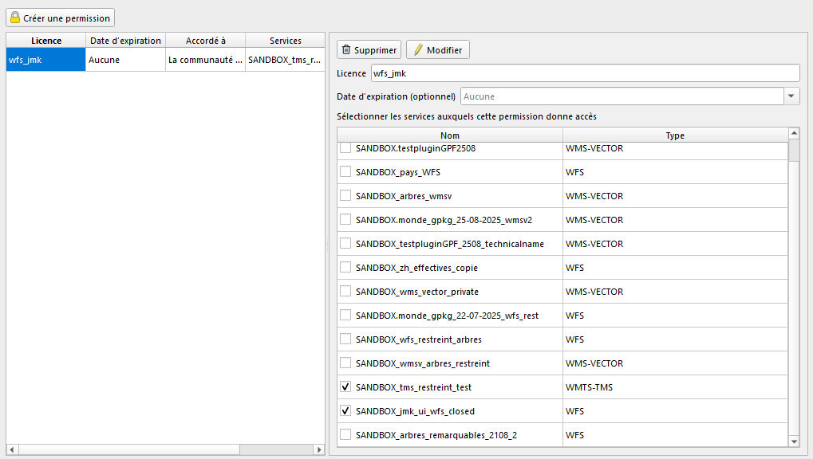

Vous pouvez modifier la permission en appuyant sur le bouton `Modifier`.

Le contenu du panneau peut être modifié et vous pouvez sélectionner les services pour la permission.

Il est nécessaire d'appuyer sur le bouton `Sauvegarder` pour valider les modifications.

Vous pouvez aussi supprimer la permission sélectionné avec le bouton `Supprimer`.

## Clés d'accès

Pour l'utilisation de service privé vous aurez besoin de créer des clés d'accès pour la Géoplateforme.

L'interface de gestion des clés d'accès peut être affichée via le bouton suivant :

Voici un aperçu de l'interface graphique disponible :

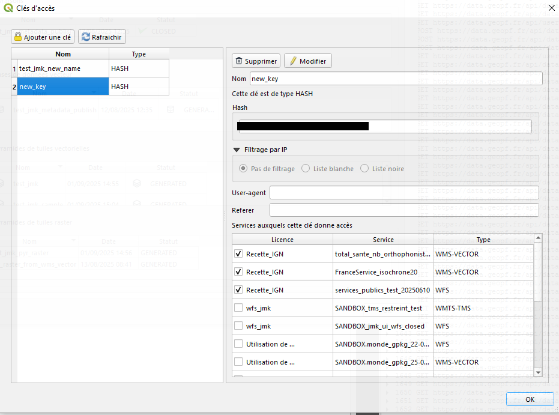

Lors de la sélection d'une clé, un panneau est affiché à droite du tableau.

Vous pouvez modifier la clé en appuyant sur le bouton `Modifier`.

Le contenu du panneau peut être modifié et vous pouvez sélectionner les services pour la clé.

Il est nécessaire d'appuyer sur le bouton `Sauvegarder` pour valider les modifications.

Vous pouvez aussi supprimer la clé sélectionnée avec le bouton `Supprimer`.

### Ajouter une clé d'accès

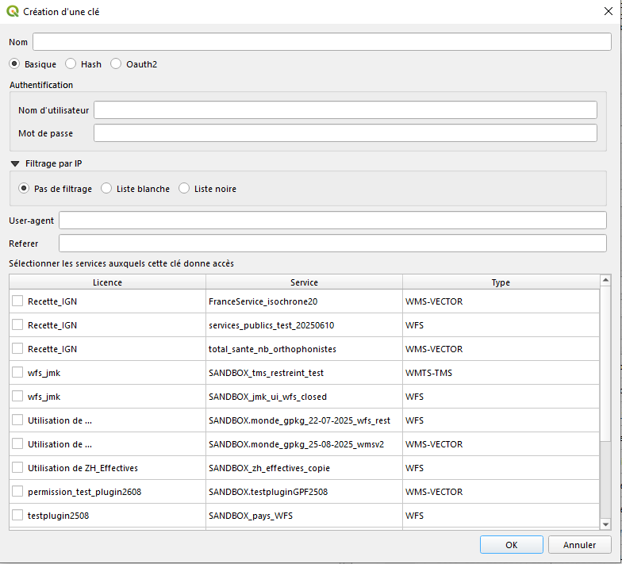

Vous pouvez choisir parmis 3 types de clés:

- Basique

Vous devez défini un nom d'utilisateur et un mot de passe. Attention, le nom d'utilisateur doit être unique dans la Géoplateforme.

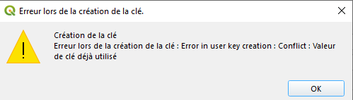

- Hash

Une valeur de hash sera calculé automatiquement par la Géoplateforme et pourra être utilisée comme paramètre complémentaire pour les requêtes vers la Géoplateforme.

- Oauth2

Votre compte Géoplateforme sera utilisé pour l'authentification. Vous ne pouvez avoir qu'une seule clé de type Oauth2.

Pour les clés de type Basique et Hash, après la création vous aurez la possibilité de créer une configuration d'authentification QGIS associée à cette clé.

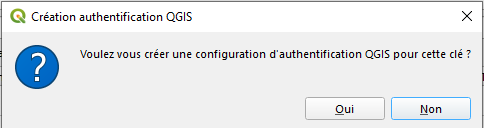

## Réglages

Les réglages utilisés par l'extension sont disponibles depuis le menu :

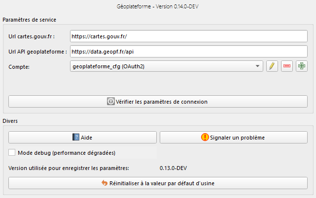

### Variables d'environnement

Ces paramètres peuvent être définis via des variables d'environnement. Ceci permet une configuration de l'extension directement par la Direction des Systèmes d'Information (DSI).

Le tableau suivant reprend les paramètres disponibles avec la variable d'environnement associée et la valeur par défaut:

|Paramètre                         | Variable d'environnement                                | Valeur par défaut                          |
|----------------------------------|---------------------------------------------------------|--------------------------------------------|
|URL requête API Géoplateforme     | `QGIS_GEOPLATEFORME_URL_API_ENTREPOT` | `https://data.geopf.fr/api/`        |
|URL requête API de recherche Géoplateforme     | `QGIS_GEOPLATEFORME_URL_API_SEARCH` | `https://data.geopf.fr/recherche/api`        |
|Identifiant des entrepôts de type bac à sable     | `QGIS_GEOPLATEFORME_SANDBOX_DATASTORE_IDS_STR` | `122b878c-aad8-4507-87b2-465e664467d3,87e1beb6-ee07-4adc-8449-6a925dc28949`        |
|Identifiant des traitement de création de pyramides raster depuis WMS-Vecteur     | `QGIS_GEOPLATEFORME_RASTER_TILES_FROM_WMS_VECTOR_PROCESSING_IDS_STR` | `6a54dc92-fc93-4c8e-9f02-046bf889550e,2e56e7ba-552b-49b8-abcf-563184dd8c55`        |
|Identifiant des traitement de création de pyramides raster depuis WMS-Vecteur     | `QGIS_GEOPLATEFORME_VECTOR_DB_GENERATION_PROCESSING_IDS_STR` | `0de8c60b-9938-4be9-aa36-9026b77c3c96, 5a348542-61a7-4289-a950-8544bb0ce2b8`        |
|Identifiant des traitement de création de pyramides vectorielles     | `QGIS_GEOPLATEFORME_VECTOR_TILE_GENERATION_PROCESSING_IDS_STR` | `0de8c60b-9938-4be9-aa36-9026b77c3c96, 5a348542-61a7-4289-a950-8544bb0ce2b8`        |
